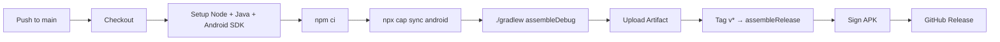

# 📱 Android APK Build Guide - Wallet Watcher Pro

## 🚀 Quick Start (Local Build)

### Prerequisites
- **Node.js 18+** and npm
- **Android Studio** (latest) with SDK 34
- **JDK 17** (Temurin recommended)
- **Gradle 8.5+** (included via wrapper)

### One-Command Build (after setup)
```bash
cd wallet-watcher-pro
npm install
npx cap sync android
cd android && ./gradlew assembleDebug
```

### APK Location
```
wallet-watcher-pro/android/app/build/outputs/apk/debug/app-debug.apk
```

---

## 🔧 Detailed Setup

### 1. Install Dependencies
```bash
# In wallet-watcher-pro directory
npm install
```

### 2. Initialize Capacitor (one-time)
```bash
npx cap init "Wallet Watcher Pro" com.walletwatcher.pro --web-dir=.
npx cap add android
```

### 3. Sync Web Assets
```bash
npx cap sync android
```

### 4. Build APK

**Debug APK (for testing):**
```bash
cd android && ./gradlew assembleDebug
```

**Release APK (for distribution):**
```bash
cd android && ./gradlew assembleRelease
```
> Requires signing config in `android/app/build.gradle` or `local.properties`

---

## 🤖 Automated Build (GitHub Actions)

### Automatic on Push/Tag
Push to `main` or create a tag `v*`:
```bash
git tag v1.0.0
git push origin v1.0.0
```

### Manual Trigger
Go to **Actions → Build Android APK → Run workflow**

### Artifacts
- **Debug APK**: 30-day retention
- **Release APK**: 90-day retention + GitHub Release

---

## 🔐 Release Signing Setup

### 1. Generate Keystore
```bash
keytool -genkey -v -keystore wallet-watcher-release.keystore \
  -alias walletwatcher -keyalg RSA -keysize 2048 -validity 10000
```

### 2. Add to GitHub Secrets
| Secret Name | Value |
|-------------|-------|
| `SIGNING_STORE_FILE` | Base64 encoded keystore |
| `SIGNING_STORE_PASSWORD` | Keystore password |
| `SIGNING_KEY_ALIAS` | `walletwatcher` |
| `SIGNING_KEY_PASSWORD` | Key password |

### 3. Encode Keystore
```bash
base64 -i wallet-watcher-release.keystore | pbcopy
```

---

## 📦 What's Included

### Capacitor Plugins
| Plugin | Purpose |
|--------|---------|
| `@capacitor/network` | Network status detection |
| `@capacitor/preferences` | Secure settings storage |
| `@capacitor/push-notifications` | FCM push notifications |
| `@capacitor/local-notifications` | Local scheduled notifications |
| `@capacitor/biometric-auth` | Fingerprint/Face ID unlock |
| `@capacitor/background-runner` | Background price updates |
| `@capacitor/app` | App lifecycle events |
| `@capacitor/haptics` | Haptic feedback |
| `@capacitor/device` | Device info |
| `@capacitor/share` | System share sheet |
| `@capacitor/clipboard` | Clipboard access |
| `@capacitor/filesystem` | File operations |
| `@capacitor/browser` | In-app browser |
| `@capacitor/splash-screen` | Animated splash |
| `@capacitor/status-bar` | Neon status bar |
| `@capacitor/keyboard` | Keyboard handling |

### Android Permissions
- `INTERNET` - API calls
- `ACCESS_NETWORK_STATE` - Connectivity detection
- `FOREGROUND_SERVICE` + `DATA_SYNC` - Background price updates
- `RECEIVE_BOOT_COMPLETED` - Auto-start on boot
- `WAKE_LOCK` - Keep CPU awake for updates
- `VIBRATE` - Haptic feedback
- `POST_NOTIFICATIONS` - Push/local notifications
- `USE_BIOMETRIC` / `USE_FINGERPRINT` - Biometric unlock
- `CAMERA` - QR code scanning (future)
- `READ/WRITE_EXTERNAL_STORAGE` - CSV/JSON export

---

## 🎨 App Features in APK

| Feature | Status |
|---------|--------|
| **Offline-first** (Service Worker) | ✅ |
| **Live prices** (CoinGecko, 30s refresh) | ✅ |
| **5 chains** (SOL/ETH/BSC/Base/TON) | ✅ |
| **Portfolio charts** (Chart.js) | ✅ |
| **Wallet management** (LocalStorage) | ✅ |
| **Transaction history** + CSV/JSON export | ✅ |
| **Notifications** (local + push ready) | ✅ |
| **Biometric lock** (Capacitor plugin) | ✅ |
| **Background sync** (WorkManager) | ✅ |
| **Deep links** (`walletwatcher://`) | ✅ |
| **Neon cyberpunk UI** | ✅ |
| **PWA installable** | ✅ |

---

## 🐛 Troubleshooting

### Build Fails: "Could not find com.getcapacitor:capacitor-android:6.0.0"
```bash
# Clear Gradle cache
cd android && ./gradlew clean
# Or delete ~/.gradle/caches
```

### Build Fails: "Manifest merger failed"
- Check `android/app/src/main/AndroidManifest.xml` for duplicate permissions
- Ensure `tools:replace` attributes if needed

### APK Too Large
```bash
# Enable R8/shrinking in build.gradle
buildTypes {
    release {
        minifyEnabled true
        shrinkResources true
    }
}
```

### Network Requests Fail on Android 9+
- `network_security_config.xml` already configured for all API domains
- Ensure `usesCleartextTraffic="false"` (default)

### Push Notifications Don't Work
1. Add `google-services.json` to `android/app/`
2. Configure FCM in Firebase Console
3. Add server key to backend (if any)

---

## 📱 Testing on Device

### Install Debug APK
```bash
adb install android/app/build/outputs/apk/debug/app-debug.apk
```

### View Logs
```bash
adb logcat -s "WalletWatcherPro" "Capacitor" "Chrome" "WebView" "*:E"
```

### Chrome DevTools
```bash
# Enable USB debugging on device
# Open chrome://inspect in Chrome on desktop
```

---

## 🔄 CI/CD Pipeline



---

## 📂 Project Structure (Android)

```
wallet-watcher-pro/
├── android/
│   ├── app/
│   │   ├── src/main/
│   │   │   ├── java/com/walletwatcher/pro/MainActivity.java
│   │   │   ├── res/
│   │   │   │   ├── values/strings.xml
│   │   │   │   ├── drawable/splash.xml
│   │   │   │   ├── mipmap-*/ic_launcher.png
│   │   │   │   ├── xml/network_security_config.xml
│   │   │   │   └── xml/file_paths.xml
│   │   │   └── AndroidManifest.xml
│   │   ├── build.gradle
│   │   └── proguard-rules.pro
│   ├── build.gradle
│   ├── settings.gradle
│   ├── gradle.properties
│   └── gradlew
├── .github/workflows/build-android.yml
├── capacitor.config.ts
├── package.json
├── manifest.json
├── service-worker.js
├── index.html
├── css/style.css
├── js/app.js
└── icons/
```

---

## 📝 Next Steps for Production

1. **Add Firebase**: `google-services.json` → `android/app/`
2. **Configure signing**: Add keystore + GitHub secrets
3. **Test on real devices**: Android 10, 11, 12, 13, 14
4. **Submit to Play Store**: Generate AAB (`./gradlew bundleRelease`)
5. **Set up monitoring**: Firebase Crashlytics, Analytics
6. **Add deep link verification**: `assetlinks.json` on domain

---

*Generated for Wallet Watcher Pro v1.0 | Capacitor 6 + Android 14*
